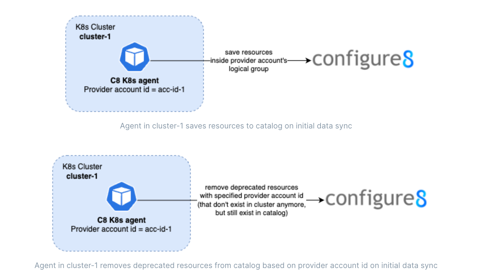
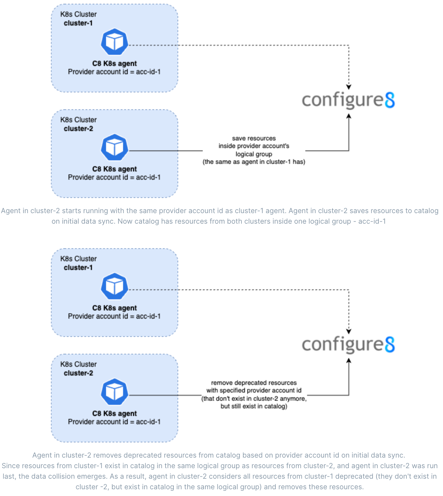
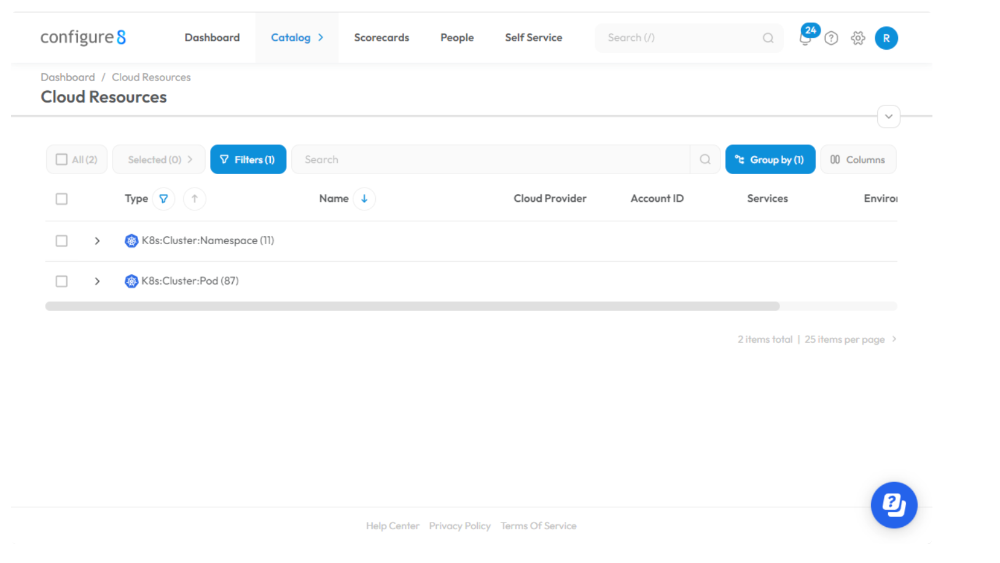

# Kubernetes agent

Discover, watch and catalog resources from any K8s cluster within your service catalog without making you K8s cluster public.

> **Note**
> Summary - Launch a Configure8 Kubernetes Agent
1. [Add configure8 chart repository to install K8s agent](#adding-configure8-chart-repository)
2. [Configure K8s agent](#configure-k8s-agent)
3. [Run K8s agent](#installing-k8s-agent)
4. The agent will start discovery and catalog resources. You can [find your resources in catalog](#visualizing-k8s-resources-in-configure8). Done!

## Configure8 K8s agent

Currently, configure8 has supports AWS EKS and GCP GKE for running discovery on Kubernetes clusters' resources. However, if you have a Kubernetes cluster deployed in an environment for which configure8 does not have native support yet, or if you simply prefer not to [make your cluster accessible for configure8 discovery](https://docs.configure8.io/configure8-product-docs/fundamentals/integrations/plug-ins/aws#kubernetes-eks), you can leverage the configure8 K8s Agent. The K8s Agent provides a universal solution for discovering and collecting data about namespaces and pods in your Kubernetes cluster, regardless of the specific environment or cloud provider.
By deploying the K8s Agent within your cluster, you can gather data about namespaces, pods and its configuration. The agent seamlessly integrates with your Kubernetes infrastructure, ensuring compatibility and reliable data collection.
Whether you are operating a Kubernetes cluster in AWS EKS, GCP GKE, on-premise or any other environment, the K8s Agent offers a flexible and reliable solution to collect the necessary data, and allows you to  have your K8s resources in the catalog, exactly the same resources that you would receive from discovery.

## Key features:

1. Seamless Integration: The K8s Agent effortlessly integrates into your Kubernetes cluster, regardless of the underlying cloud provider or deployment environment. It works harmoniously with popular platforms like AWS EKS, GCP GKE, and others, allowing you to extract data consistently across different infrastructures.
2. Efficient Resource Utilization: The K8s Agent is designed to be lightweight and optimized for Kubernetes. It minimizes its impact on the overall cluster performance and resource consumption while efficiently handling data collection tasks. This ensures that your cluster's resources are utilized effectively for running your applications. The most resource-intensive task is performed on agent start, when agent synchronizes all existing cluster resources and catalog. After performing initial data sync, agent will start watching cluster changes, so that on the next sync only changed data will be updated in the catalog.
3. Flexible Configuration: The agent offers flexible configuration options, allowing you to customize its behavior according to your specific needs. You can define the interval for data sync, specify data for building correct relations etc.
4. Logging: The K8s Agent logs its own activities, allowing you to check the agent's state and operational status. By reviewing the agent logs, you can monitor its behavior, identify any issues or errors, and ensure that the agent is functioning optimally within your cluster.


K8s agent is tested on versions of Kubernetes API server starting from v1.19.0. In case of older versions, stability of work is not guaranteed. Older versions may be supported in the future upon request. 

> **Info**
> K8s agent is tested on versions of Kubernetes API server starting from v1.19.0. In case of older versions, stability of work is not guaranteed. Older versions may be supported in the future upon request. 

## How agent works?

On the start agent will perform initial data synchronisation. It gets all current resources in the cluster (for now pods and namespaces) and save it to your catalog using [Configure8 Public API](https://docs.configure8.io/configure8-product-docs/reference/api-documentation).
If [cluster resource key](https://docs.configure8.io/configure8-product-docs/fundamentals/integrations/plug-ins/kubernetes-agent#configure8-k8s-agent) is provided and cluster with this key exists, parent-child relations for new resources is set up and [auto mapping](https://docs.configure8.io/configure8-product-docs/fundamentals/resources/resource-auto-mapping) is performed.
New resources [are assigned to provider account id](https://docs.configure8.io/configure8-product-docs/fundamentals/integrations/plug-ins/kubernetes-agent#about-provider-account-id) and after all data is saved, agent performs removing of deprecated resources in this provider account.
After performing initial sync and removing deprecated data, agent enters watch mode - it constantly watches cluster state and caches changes. This approach allows agent to work more efficiently, so that on every next data sync only changed data will be updated in the catalog.

## Prerequisite
In order to launch configure8 K8s agent, you will need to create API key. Please check the [following page](https://docs.configure8.io/configure8-product-docs/fundamentals/settings/api-key-management#create) for more information.

## Adding configure8 chart repository

Adds [Configure8](https://app.configure8.io) chart repository

```bash
helm repo add c8 https://k8s-agent-helm.configure8.io/store/
helm repo update
```

_See [helm repo](https://helm.sh/docs/helm/helm_repo/) for command documentation._

To check available charts:

```
helm search repo c8-k8s-agent
NAME           	CHART VERSION	APP VERSION	DESCRIPTION
c8/c8-k8s-agent	0.0.4        	1.0.0      	A Helm chart for c8 k8s-agent
```

## Configure K8s agent

You can configure the chart before installing. Here is the list of props to customise:

| Key | Type | Default | Description |
|-----|------|---------|-------------|
| affinity | object | `{}` | affinity |
| fullnameOverride | string | `""` |  |
| image.pullPolicy | string | `"IfNotPresent"` | Image pull policy |
| image.repository | string | `"public.ecr.aws/c8-public/c8-k8s-agent"` | c8 k8s-agent repo |
| image.tag | string | `"1.1.1"` | Overrides the image tag whose default is the latest. |
| imagePullSecrets | list | `[]` | image pull secrets |
| nameOverride | string | `""` |  |
| nodeSelector | object | `{}` | node selector |
| podAnnotations | object | `{}` | pod annotations |
| podSecurityContext | object | `{"fsGroup":1008,"runAsGroup":1008,"runAsNonRoot":true,"runAsUser":1008}` | pod pod security context |
| replicaCount | int | `1` | replica count |
| resources | object | `{"limits":{"cpu":"500m","memory":"512Mi"},"requests":{"cpu":"250m","memory":"512Mi"}}` | Specify resources |
| securityContext.allowPrivilegeEscalation | bool | `false` |  |
| securityContext.capabilities.drop[0] | string | `"ALL"` |  |
| securityContext.seccompProfile.type | string | `"RuntimeDefault"` |  |
| serviceAccount.annotations | object | `{}` | Annotations to add to the service account |
| serviceAccount.create | bool | `true` | Specifies whether a service account should be created |
| serviceAccount.name | string | `""` | The name of the service account to use. If not set and create is true, a name is generated using the fullname template |
| tolerations | list | `[]` | tolerations |
| variables.CLUSTER_RESOURCE_KEY | string | `""` | key/value pairs to add as variables to the pod |
| variables.CONFIGURE8_API_TOKEN | string | `""` | API token for accessing public API. The agent will fail on start if this parameter is not specified. We kindly recommend you don't specify this environment as a simple variable. Please use the example above on how to create and put this value as a Kubernetes secret. |
| variables.CONFIGURE8_URL | string | `"https://app.configure8.io/public/v1"` | Url to configure8 public API |
| variables.FREQUENCY_HOURS | string | `"24"` | Data sync frequency. The number of hours for discovery schedule. Cannot be less than 1. |
| variables.LOGGING_LEVEL | string | `"info"` | Agent logging level. Possible options - 'fatal', 'error', 'warn', 'info', 'debug', 'trace' or 'silent'. Be aware - trace log level will be quite verbose, since it will also print cluster changes. |
| variables.PROVIDER_ACCOUNT_ID | string | `""` | Provider account id for the cluster and its resources. If provided, resources will be created with the specified provider account id. |
| variables.variables_from_configmaps | object | `{"configmap_names":[]}` | variables from configmaps |
| variables.variables_from_secrets | object | `{"secrets_names":[]}` | variables from secrets |

It is highly crucial to configure your environment variables properly for agent to work correctly.

CONFIGURE8_API_TOKEN and PROVIDER_ACCOUNT_ID are required parameters for agent. The agent will fail on start if these parameters are not specified. 

> **Warn**
> CONFIGURE8_API_TOKEN and PROVIDER_ACCOUNT_ID are required parameters for agent. The agent will fail on start if these parameters are not specified. 

> **Warn**
> Configure8 API token must have write rights for agent to work properly.

> **Info**
> Provider resource key expected to be an unique value. If your catalog contains multiple entities that have the same provider resource key, which you specified as you cluster resource key, the inconsistency will appear. Agent will take the first one as a parent for resources (if provider account id is provided, then it takes the first one that has the specified provider account id). So please be aware of this case and make sure, your entities' resource keys are unique to avoid such situation.

## About provider account id

Consider provider account id as a logical group for your resources inside your catalog. For example, when you create [AWS credentials](https://docs.configure8.io/configure8-product-docs/fundamentals/integrations/plug-ins/aws#creating-an-aws-credential) for running discovery, all resources that will be discovered, will have provider account id set to AWS account id. So that all resources are in the logical group that equals AWS account id. When next discovery is run for these credentials, new resources will be saved to catalog and all resources inside this provider account id that exist in catalog, but don't exist in cloud anymore, will be deleted. This is how data synchronisation is working. 
Provider account id for K8s agent also enables correct resource deprecation on initial data synchronisation. All cluster's resources that exist in your catalog for this provider account id, but don't exist in your cluster anymore (so that they become deprecated), will be automatically removed from catalog. This is crucial for having consistent data in the catalog. For example, if you run agent and decided to stop it for a while and freshly rerun after some period of time, your deprecated K8s resources will be removed based on specified provider account id.

## What value has to be used as provider account id for your agent?

It is important to have individual provider account id for every agent. 

For example, if you have only one cluster in your AWS EKS account in one region, then you can define provider account id value same as other resources inside this AWS account have - your AWS account id. But if you have multiple clusters inside your AWS account, and you define the same provider account id for every agent, this approach won't work properly.
Here is why. As was stated before - provider account id as a logical group for your resources. If multiple agents, that run in different clusters and therefore discover different resources, have the same account id, Configure8 catalog will assume, that resources from these multiple agents are in the same logical group and resource deprecation logic will work incorrectly (you may not see resources from some agents, since they may be considered as deprecated inside this logical group on agent initial synchronisation). This situation is illustrated below in a more detailed way.




That is why it's important to create an individual logical group for every K8s agent that you run by assigning unique provider account id.

> **Info**
> We recommend to choose some scheme which is suitable for your case to set provider account ids for agents.
Here is one of possible solutions. If you have multiple clusters in one AWS account, you can use this pattern for provider account ids - aws-account-id/region/cluster-name

## Installing K8s agent

Create a secret that will contain CONFIGURE8_API_TOKEN to communicate with C8 (please don't forget to add -n 'namespace' if you want to install c8-k8s-agent to the specific namespace)

```bash
kubectl create secret generic 'secret_name' --from-literal=CONFIGURE8_API_TOKEN='api-token'
```

To install the chart with the release name ```my-release```:

```bash
helm install my-release c8/c8-k8s-agent
```

One of the ways to set environment variables looks like this (please replace values with relevant data):

```bash
helm install my-release c8/c8-k8s-agent \
  --set variables.FREQUENCY_HOURS=12 \
  --set variables.PROVIDER_ACCOUNT_ID='provider-account-id' \
  --set variables.LOGGING_LEVEL='debug' \
  --set variables.CLUSTER_RESOURCE_KEY='cluster-resource-key' \
  --set variables.variables_from_secrets.secrets_names={'secret_name'} \
  --set variables.CONFIGURE8_URL='url'
```

Or, alternatively, you can set CONFIGURE8_API_TOKEN variable as inline variable, without using secret (please replace values with relevant data):

```
helm install my-release c8/c8-k8s-agent \
  --set variables.FREQUENCY_HOURS=12 \
  --set variables.PROVIDER_ACCOUNT_ID='provider-account-id' \
  --set variables.LOGGING_LEVEL='debug' \
  --set variables.CLUSTER_RESOURCE_KEY='cluster-resource-key' \
  --set variables.CONFIGURE8_API_TOKEN='api-token' \
  --set variables.CONFIGURE8_URL='url'
```

> **Warn**
> We kindly recommend you don't specify CONFIGURE8_API_TOKEN variable as a simple variable. Please use the [example](https://docs.configure8.io/configure8-product-docs/fundamentals/integrations/plug-ins/kubernetes-agent#installing-k8s-agent) above on how to create and put this value as a Kubernetes secret.

After successful installation you can check status using ```helm status``` and check K8s agent pod logs to ensure that agent works correctly.

## Visualizing K8s resources in configure8

After configure8 start receiving information form the K8s agent, you will be able to see the following new [Cloud Resources](https://docs.configure8.io/configure8-product-docs/fundamentals/resources) types:

- K8s:Cluster:Namespace
- K8s:Cluster:Pod



## Troubleshooting

There might be some cases, when the resources, that are received from an agent and exist in your catalog, do not match your cluster state (e.g. the catalog is missing some pods or namespaces from the cluster or the auto mapping has not worked). Here are some steps, that may help you fixing unexpected behaviour:

1. **Check the agent's logs**. Depending on the level of logging you have specified for the agent, you may see the state of agent and its last action. Pay attention to error logs if there are any, they might be helpful in order to identify the problem.
2. **Between data syncs**. Data consistency depends on the frequency of data sync. If plenty of new resources appeared in your cluster just recently, and the last data sync was before these changes, you should wait for next data sync to be performed in order to have relevant data in your catalog. Data sync frequency is configured on agent setup. 
3. **Check the agent's configuration**. It might happen, that cluster resource key or other parameters were not configured properly, and it might cause some unexpected behaviour. For example, if auto mapping with cluster tags does not work, there might be a problem with fetching cluster by specified resource key.
4. **Rerun the agent**. There might be some cases, when you can initialise initial data sync by forcefully restarting your agent in order to fix data inconsistency. This will trigger initial data synchronisation on agent's start. 
For example, if you see that auto mapping has not worked for some resources, and you have just recently created services and environments for resources to be mapped to, you can try to rerun the agent.  
Another example is if your agent was running in watch mode and you removed some K8s resources from catalog (via public API), on the next data sync, only the resources that were changed between data syncs will be saved in the catalog. To resave all the resources in your cluster, you should rerun agent.
5. **[Contact us](https://www.configure8.io/contact)** if no steps from this list have resolved your issue.  

## Uninstalling K8s agent

To uninstall/delete the my-release deployment:

```
helm uninstall my-release
```

The command removes all the Kubernetes components associated with the chart and deletes the release.
